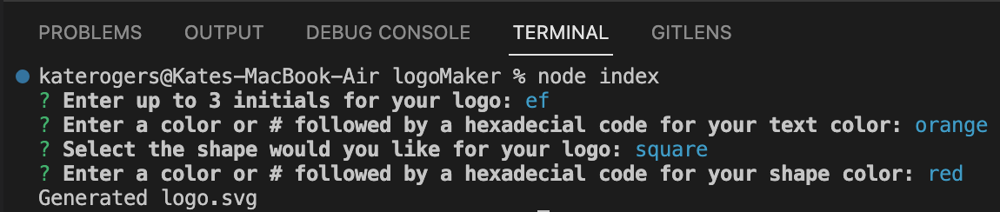

# Logo Generator

## Description

This is a Node.js command-line application that takes in user input to generate a logo and save it as an SVG file. It prompts the user to select a color and shape, provide text for the logo, and save the generated image. 

This project:
- streamlines creating simple logo images.
- allowed me to practice working with command line applications as well as making tests.
- reinforced the idea that there isn't just one "right" answer in coding.

## Usage

In the terminal type "node index" to run the application. 

Answer the prompts and open your SVG in finder once its generated.  

[Video Demonstration](https://drive.google.com/file/d/1Us73TF3-JSuJXZKFo3fIXiTSG2FoBGS0/view)
    

## License

MIT License

Copyright (c) 2023 Kate Rogers

Permission is hereby granted, free of charge, to any person obtaining a copy
of this software and associated documentation files (the "Software"), to deal
in the Software without restriction, including without limitation the rights
to use, copy, modify, merge, publish, distribute, sublicense, and/or sell
copies of the Software, and to permit persons to whom the Software is
furnished to do so, subject to the following conditions:

The above copyright notice and this permission notice shall be included in all
copies or substantial portions of the Software.

THE SOFTWARE IS PROVIDED "AS IS", WITHOUT WARRANTY OF ANY KIND, EXPRESS OR
IMPLIED, INCLUDING BUT NOT LIMITED TO THE WARRANTIES OF MERCHANTABILITY,
FITNESS FOR A PARTICULAR PURPOSE AND NONINFRINGEMENT. IN NO EVENT SHALL THE
AUTHORS OR COPYRIGHT HOLDERS BE LIABLE FOR ANY CLAIM, DAMAGES OR OTHER
LIABILITY, WHETHER IN AN ACTION OF CONTRACT, TORT OR OTHERWISE, ARISING FROM,
OUT OF OR IN CONNECTION WITH THE SOFTWARE OR THE USE OR OTHER DEALINGS IN THE
SOFTWARE.

## Tests

To run the included tests type "npm test" in the terminal.